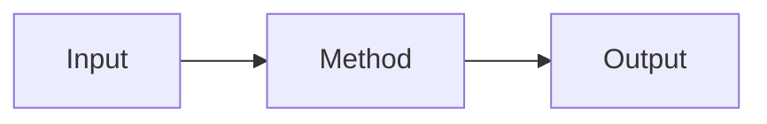

# 论文阅读模板

> [!info] 论文基本信息
> - **标题**：
> - **作者**：
> - **发表**：
> - **链接**：
> - **阅读日期**：

> [!tip] 相关笔记
> - **术语对照**：[[AI研究/AI学习/常见术语对照]] - 论文术语速查
> - **学习路径**：[[AI研究/AI学习/AI模型系统性学习路径]] - 论文阅读计划

---

## 一句话总结

---

## 研究背景

### 问题是什么？

### 为什么重要？

### 现有方法的局限？

---

## 核心贡献

> [!tip] 贡献清单
> 1.
> 2.
> 3.

---

## 方法详解

### 整体框架



### 关键公式

$$公式$$

**变量说明**：
- $x$：
- $y$：

### 算法流程

```python
# 伪代码
def algorithm(input):
    # Step 1
    # Step 2
    # Step 3
    return output
```

---

## 实验结果

### 数据集

| 数据集 | 规模 | 任务 |
|:-------|:----:|:-----|
| | | |

### 主要结果

| 方法 | 指标1 | 指标2 | 指标3 |
|:-----|-----:|-----:|-----:|
| 基线 | | | |
| 本文 | | | |

### 消融实验

---

## 个人思考

### 优点

### 缺点

### 延伸问题

---

## 相关论文

- [ ] 论文1
- [ ] 论文2
- [ ] 论文3

---

## 代码实现

- **链接**：
- **框架**：
- **难度**：

---

## 笔记与疑问

### 重要概念

### 疑问点

---

## 总结

### 是否值得精读？

### 实用性评分

⭐⭐⭐⭐⭐

### 下一步行动

- [ ] 复现论文
- [ ] 应用到项目
- [ ] 分享给他人

---

#论文 #模板
