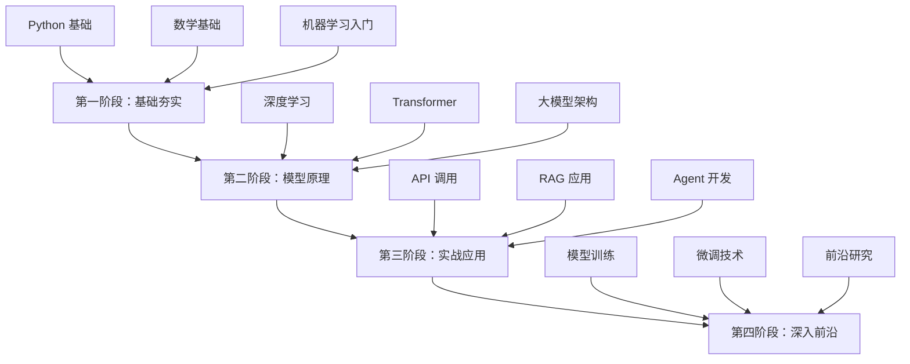

# AI模型系统性学习路径

> [!info] 学习者画像
> - **基础水平**：有编程基础（Python），无 ML 经验
> - **学习目标**：全面掌握（原理 + 实践）
> - **时间投入**：每周 5-10 小时

> [!tip] 快速导航
> - **返回索引**：[[AI研究/AI学习/00-知识库索引]] - 知识库导航中心
> - **术语速查**：[[AI研究/AI学习/常见术语对照]]
> - **周计划**：[[AI研究/AI学习/周学习计划]]
> - **实战应用**：
>   - [[AI研究/AI学习/03-实战应用/LangChain全面解析]] - LangChain 框架
>   - [[AI研究/AI学习/03-实战应用/LangGraph全面解析]] - LangGraph 状态机
>   - [[AI研究/AI学习/03-实战应用/Agent全面解析]] - Agent 智能体
>   - [[AI研究/AI学习/03-实战应用/RAG全面解析]] - RAG 检索增强
> - **基础笔记**：[[AI研究/AI学习/01-基础夯实]] / [[AI研究/AI学习/02-模型原理]] / [[AI研究/AI学习/03-实战应用]] / [[AI研究/AI学习/04-深入前沿]]

---

## 📚 学习路径总览



---

## 🎯 第一阶段：基础夯实（4-6周）

### 1.1 Python 基础巩固

**目标**：熟练使用 Python 进行数据处理

> [!todo]- 学习清单
> - [x] 基础语法（你已经会了）
> - [ ] NumPy：数组运算、矩阵操作
> - [ ] Pandas：数据处理、DataFrame
> - [ ] Matplotlib/Seaborn：数据可视化
> - [ ] Jupyter Notebook 使用

**推荐资源**
- 📖 [[Python数据分析\|Python for Data Analysis]]
- 🎓 NumPy 官方教程
- 🎓 Pandas 官方教程

### 1.2 数学基础

**目标**：理解 ML 背后的数学原理

> [!warning] 不用学太深
> 只需掌握核心概念，不用成为数学家

**必学内容**
| 概念 | 重要程度 | 用途 |
|:-----|:--------:|:-----|
| 线性代数 | ⭐⭐⭐⭐⭐ | 矩阵运算、维度变换 |
| 微积分 | ⭐⭐⭐⭐ | 梯度下降、反向传播 |
| 概率统计 | ⭐⭐⭐⭐ | 损失函数、不确定性 |
| 信息论 | ⭐⭐⭐ | 熵、交叉熵 |

**推荐资源**
- 📖 3Blue1Brown《线性代数本质》
- 📖 3Blue1Brown《微积分本质》
- 📖 《深度学习》- 花 书（第一部分）

### 1.3 机器学习入门

**目标**：理解 ML 基本概念和流程

> [!tip] 从经典算法开始
> 先学传统 ML，再学深度学习，理解会更透彻

**核心概念**
- 监督学习 vs 无监督学习
- 过拟合 vs 欠拟合
- 交叉验证
- 特征工程

**经典算法**
- 线性回归
- 逻辑回归
- 决策树/随机森林
- K-近邻
- K-means 聚类

**推荐资源**
- 🎓 吴恩达《Machine Learning》课程
- 📖 《统计学习方法》- 李航
- 🎓 Scikit-learn 实战

**实践项目**
- 房价预测（回归）
- 手写数字识别（分类）
- 客户细分（聚类）

---

## 🧠 第二阶段：模型原理（8-10周）

### 2.1 深度学习基础

**目标**：理解神经网络工作原理

> [!note] 从感知机到深度网络
> 理解每一层的意义

**核心内容**
| 主题 | 知识点 |
|:-----|:-------|
| 神经网络 | 感知机、多层网络、激活函数 |
| 训练过程 | 前向传播、损失函数、反向传播 |
| 优化器 | SGD、Adam、学习率调度 |
| 正则化 | Dropout、BatchNorm、权重衰减 |

**推荐资源**
- 🎓 吴恩达《Deep Learning Specialization》
- 📖 《动手学深度学习》
- 🎓 fast.ai 课程

**实践项目**
- 构建 MLP 进行 MNIST 分类
- 实现 CNN 进行图像分类
- 实现 RNN 进行文本分类

### 2.2 Attention 与 Transformer

**目标**：理解现代 AI 的核心架构

> [!important] 这是现代大模型的基石
> 必须深入理解

**核心内容**
| 组件 | 作用 |
|:-----|:-----|
| Self-Attention | 捕捉序列内部依赖 |
| Multi-Head Attention | 多视角理解 |
| Positional Encoding | 保留位置信息 |
| Encoder-Decoder | 序列到序列映射 |

**Transformer 架构**
- Encoder-only：BERT、RoBERTa
- Decoder-only：GPT 系列、LLaMA
- Encoder-Decoder：T5、BART

**推荐资源**
- 📖 "Attention Is All You Need" 论文
- 🎓 Jay Alammar《The Illustrated Transformer》
- 🎓 3Blue1Brown《注意力机制》

### 2.3 大语言模型 (LLM)

**目标**：理解 GPT、Claude 等模型原理

**核心概念**
- Tokenizer：BPE、WordPiece
- 位置编码：RoPE、ALiBi
- 激活函数：GeLU、SwiGLU
- 归一化：LayerNorm、RMSNorm
- 参数规模：从 1B 到 1T+

**主流模型对比**

| 模型 | 架构 | 特点 |
|:-----|:-----|:-----|
| GPT-4 | Decoder-only | 强大的生成能力 |
| Claude | Decoder-only | 长文本、安全对齐 |
| LLaMA | Decoder-only | 开源、高效 |
| BERT | Encoder-only | 理解任务 |
| T5 | Enc-Dec | 序列到序列 |

**推荐资源**
- 📖 "Language Models are Few-Shot Learners" (GPT-3)
- 📖 "Constitutional AI" (Claude)
- 📖 LLaMA 系列论文
- 🎓 Andrej Karpathy《Let's build GPT》

---

## 🛠️ 第三阶段：实战应用（6-8周）

### 3.1 API 调用与 Prompt Engineering

**目标**：熟练使用各类 AI API

> [!tip] 你已经有了聚合平台对比笔记
> 可以直接参考 [[AI研究/ai聚合模型对比]]

**核心技能**
- OpenAI API 使用
- Claude API 使用
- Prompt 设计原则
- Token 管理与成本控制

**Prompt 技巧**
- Few-shot Learning
- Chain-of-Thought
- Self-Consistency
- ReAct 框架

**推荐资源**
- 📖 OpenAI Prompt Engineering Guide
- 📖 "Prompt Engineering Guide"
- 📖 Anthropic Prompt 库

**实践项目**
- 构建聊天机器人
- 文档摘要系统
- 代码助手
- 翻译工具

### 3.2 RAG (检索增强生成)

**目标**：构建知识库问答系统

**架构组成**
- 文档切分：Chunking 策略
- 向量嵌入：Embedding 模型
- 向量数据库：Chroma、FAISS
- 检索策略：相似度、重排序
- 生成合成：RAG Fusion

**推荐资源**
- 📖 LangChain 文档
- 📖 LlamaIndex 文档
- 🎓 "Retrieval-Augmented Generation" 综述

**实践项目**
- 个人知识库问答
- 技术文档助手
- 企业内部搜索

### 3.3 Agent 开发

**目标**：构建自主智能体

**核心组件**
- 规划 (Planning)
- 记忆 (Memory)
- 工具 (Tools)
- 执行 (Execution)

**主流框架**
| 框架 | 特点 |
|:-----|:-----|
| LangChain | 功能全面、生态丰富 |
| AutoGPT | 自主执行 |
- BabyAGI | 任务分解 |
| CrewAI | 多 Agent 协作 |

**实践项目**
- 自动研究助理
- 代码审查 Agent
- 数据分析 Agent

---

## 🔬 第四阶段：深入前沿（持续）

### 4.1 模型训练与微调

**目标**：训练自己的模型

**微调方法**
- Full Fine-tuning
- LoRA / QLoRA
- Prefix Tuning
- Prompt Tuning

**推荐资源**
- 🎓 Hugging Face Transformers 课程
- 📖 "LoRA: Low-Rank Adaptation of Large Language Models"
- 📖 "QLoRA: Efficient Finetuning of LLMs"

### 4.2 前沿技术追踪

**关注方向**
- 多模态模型
- 长上下文
- 推理能力
- 具身智能
- AI 安全

**信息渠道**
- ArXiv 每日更新
- Hugging Face Papers
- OpenAI/Anthropic Blog
- 顶级会议（NeurIPS、ICML、ACL）

---

## 📅 学习时间规划

### 每周 5-10 小时分配建议

| 活动 | 时间 | 说明 |
|:-----|:-----|:-----|
| 理论学习 | 2-3h | 看视频、读文章 |
| 代码实践 | 2-3h | 跟着教程敲代码 |
| 项目实战 | 1-2h | 做小项目 |
| 总结笔记 | 1h | 记录心得 |
| 论文阅读 | 0-1h | 进阶后加入 |

### 学习节奏建议

**第1-3个月**：打好基础
- 专注第一阶段
- 不要急于学大模型
- 数学跟着学，不用太深

**第4-6个月**：深入原理
- Transformer 是重点
- 多看论文、多写代码
- 开始小项目

**第7-12个月**：实战应用
- RAG、Agent 是热点
- 做完整的端到端项目
- 开始关注前沿

---

## 🎓 推荐学习顺序

### 必学内容（按顺序）

1. **[[Python数据处理\|NumPy/Pandas]]** → 1周
2. **[[数学基础\|线性代数/微积分]]** → 2周（边学边用）
3. **[[机器学习\|ML基础]]** → 3周
4. **[[深度学习\|DL基础]]** → 4周
5. **[[Transformer\|Attention机制]]** → 2周
6. **[[LLM原理\|大模型架构]]** → 3周
7. **[[API开发\|Prompt工程]]** → 2周
8. **[[RAG应用\|检索增强]]** → 3周
9. **[[Agent开发\|智能体]]** → 3周

### 选学内容

- 模型部署（vLLM、TensorRT-LLM）
- 多模态模型
- 强化学习
- AI 安全与对齐

---

## 📝 学习笔记建议

### 笔记结构

```markdown
## 概念笔记
- 核心概念定义
- 关键公式/代码
- 个人理解

## 实践笔记
- 项目记录
- 踩坑经验
- 代码片段

## 论文笔记
- 核心贡献
- 方法概述
- 思考启发
```

### 推荐笔记工具

- Obsidian（你现在用的 ✅）
- Notion
- Obsidian + Excalidraw（画图）

---

## 🚀 快速启动：本周任务

> [!tip] 第一周：Python 数据处理入门
>
> ### Day 1-2: NumPy
> - 创建数组、索引、切片
> - 矩阵运算、广播机制
>
> ### Day 3-4: Pandas
> - DataFrame 创建与操作
> - 数据清洗、过滤、分组
>
> ### Day 5-6: 综合实践
> - 加载 CSV 数据
> - 数据探索与分析
> - 简单可视化
>
> ### Day 7: 总结
> - 整理本周笔记
> - 记录疑问点

---

## 📚 核心资源清单

### 免费课程
- [ ] 吴恩达 Machine Learning
- [ ] 吴恩达 Deep Learning Specialization
- [ ] fast.ai Practical Deep Learning for Coders
- [ ] 3Blue1Brown 数学系列

### 书籍
- [ ] 《动手学深度学习》
- [ ] 《深度学习》（花书）
- [ ] 《统计学习方法》
- [ ] 《Python深度学习》

### 论文
- [ ] Attention Is All You Need (2017)
- [ ] GPT-3 (2020)
- [ ] Instruction Tuning (2022)
- [ ] Constitutional AI (2022)
- [ ] LLaMA (2023)

### 工具框架
- [ ] PyTorch
- [ ] Hugging Face Transformers
- [ ] LangChain
- [ ] LlamaIndex

---

## 💡 学习建议

1. **代码为主，理论为辅**
   - 不要只看视频，一定要写代码
   - 理论是为了理解代码在做什么

2. **项目驱动学习**
   - 每学完一个知识点就做小项目
   - 项目不求大，但求完整

3. **善用 AI 辅助**
   - 用 Claude/GPT 解释概念
   - 生成练习代码
   - Code Review

4. **加入社区**
   - GitHub 逛项目
   - Hugging Face 讨论区
   - Reddit r/MachineLearning

5. **保持耐心**
   - 这是一场马拉松
   - 前三个月最痛苦
   - 坚持下去就会有收获

---

#AI #学习计划 #深度学习 #LLM
